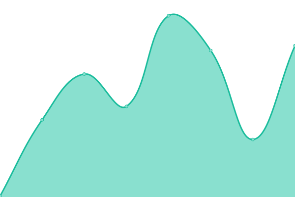
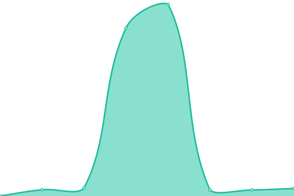
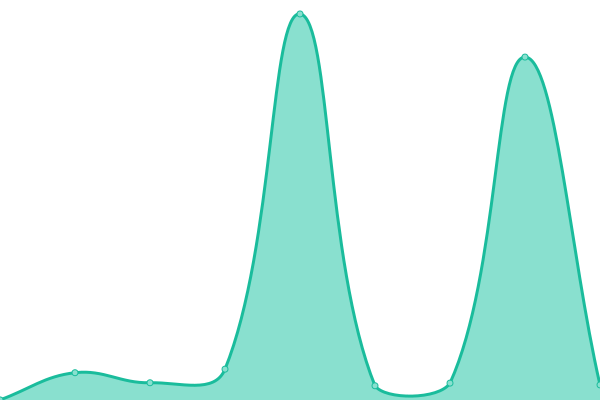

# [📈 Live Status](https://ErnesthoMtz.github.io/upptime): <!--live status--> **🟩 All systems operational**

This repository contains the open-source uptime monitor and status page for [Ernesto Martínez](https://ErnesthoMtz.github.io/upptime), powered by [Upptime](https://github.com/upptime/upptime).

With [Upptime](https://upptime.js.org), you can get your own unlimited and free uptime monitor and status page, powered entirely by a GitHub repository. We use [Issues](https://github.com/ErnesthoMtz/upptime/issues) as incident reports, [Actions](https://github.com/ErnesthoMtz/upptime/actions) as uptime monitors, and [Pages](https://ErnesthoMtz.github.io/upptime) for the status page.

<!--start: status pages-->
<!-- This summary is generated by Upptime (https://github.com/upptime/upptime) -->
<!-- Do not edit this manually, your changes will be overwritten -->
<!-- prettier-ignore -->
| URL | Status | History | Response Time | Uptime |
| --- | ------ | ------- | ------------- | ------ |
|  [PreRegistrate](https://preregistrate.mx) | 🟩 Up | [pre-registrate.yml](https://github.com/ErnesthoMtz/upptime/commits/HEAD/history/pre-registrate.yml) | 

 157ms
     
 | 

<a href="https://ErnesthoMtz.github.io/upptime/history/pre-registrate">100.00%</a>
    

|  [GamaVirtual](https://gamavirtual.mx) | 🟩 Up | [gama-virtual.yml](https://github.com/ErnesthoMtz/upptime/commits/HEAD/history/gama-virtual.yml) | 

 2516ms
     
 | 

<a href="https://ErnesthoMtz.github.io/upptime/history/gama-virtual">100.00%</a>
    

|  [MiDesarrolloTec](https://midesarrollotec.mx) | 🟩 Up | [mi-desarrollo-tec.yml](https://github.com/ErnesthoMtz/upptime/commits/HEAD/history/mi-desarrollo-tec.yml) | 

 2375ms
     
 | 

<a href="https://ErnesthoMtz.github.io/upptime/history/mi-desarrollo-tec">100.00%</a>
    

<!--end: status pages-->

[**Visit our status website →**](https://ErnesthoMtz.github.io/upptime)

## 📄 License

- Powered by: [Upptime](https://github.com/upptime/upptime)
- Code: [MIT](./LICENSE) © [Ernesto Martínez](https://ErnesthoMtz.github.io/upptime)
- Data in the `./history` directory: [Open Database License](https://opendatacommons.org/licenses/odbl/1-0/)
